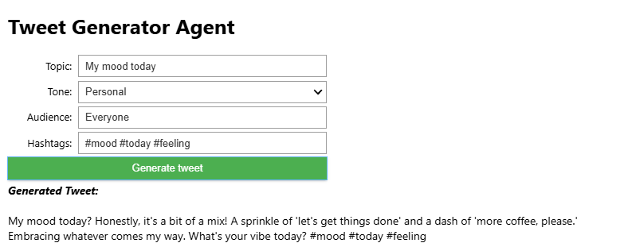

# 🐦 Simple Twitter Agent with Gemini API

A Jupyter Notebook app to generate creative tweets using Google Gemini (Generative AI) and a beautiful interactive UI.

---

## ✨ Features
- Generate tweets on any topic, for any audience, in various tones
- Add custom hashtags
- Interactive and user-friendly form (powered by `ipywidgets`)
- Keeps tweets under 280 characters
- Secure API key management with `.env` file

---

## 🚀 Quick Start

### 1. Clone the repository
```bash
git clone https://github.com/Sakil78/Tweet-Generator-Agent.git
cd Tweet-Generator-Agent
```

### 2. Install requirements
Open the notebook and run the first cell, or install manually:
```bash
pip install google-generativeai ipywidgets python-dotenv
```

### 3. Set up your Gemini API key
- Create a `.env` file in the project folder (already included):
  ```env
  GEMINI_API_KEY=your_actual_key_here
  ```
- Replace `your_actual_key_here` with your Gemini API key ([get one here](https://aistudio.google.com/app/apikey)).

### 4. Run the notebook
- Open `My_Simple_twitter_agent.ipynb` in Jupyter or VS Code
- Run all cells
- Fill in the form and click **Generate tweet**

---

## 📸 Screenshot


---

## 🛡️ Security
- **Never share your `.env` file or API key.**
- The `.env` file is included in `.gitignore` by default (add it if not present).

---

## 📝 License
MIT License

---

## 🙏 Credits
- [Google Generative AI (Gemini)](https://ai.google.dev/)
- [ipywidgets](https://ipywidgets.readthedocs.io/)
- [python-dotenv](https://pypi.org/project/python-dotenv/)

---

Enjoy tweeting smarter! 🚀
